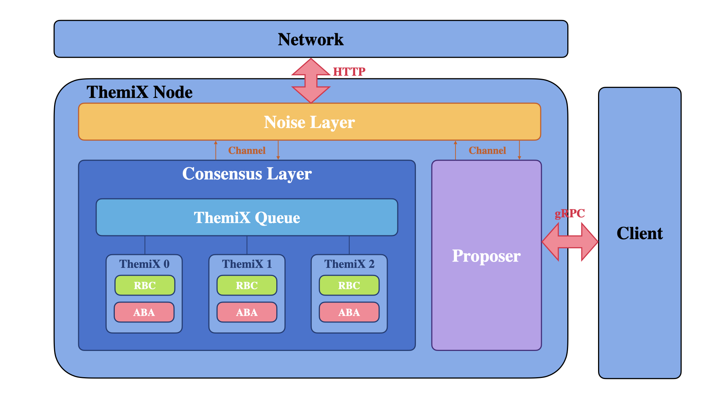

## What is ThemiX-beta?

ThemiX-beta is the normal case version of the time-assumption balanced consensus ThemiX.

## Design Overview

This is the high-level architecture of ThemiX, it consists of three components:
- `noise layer`
- `consensus layer`
- `proposer`



### Noise Layer
Noise layer uses a p2p library to communication with other themix nodes. In current implementation, the noise layer has many components:
- Noise node, which broadcasts and receives messages from other themix nodes.
- Verify pool, which verifies message signature.

### Consensus Layer
Consensus layer is the layer to run themix consensus. This layer consists of a queue of themix. Themix adapts ACS (Asynchronous Common Subset) framework, which consists of RBC (Reliable Broadcast) and ABA (Asynchronous Binary Agreement).

### Proposer
Proposer communicates with client using gRPC, the message sent between them is in the form of protobuf.

## Getting Started

Clone and build.
```sh
git clone https://github.com/Snowfall99/themix-beta.git
cd themix-beta
go mod tidy
make
```

Generate BLS keys and ECDSA key.
```sh
cd crypto
# generate BLS keys
go run cmd/bls/main.go -n 5 -t 3
# generate ECDSA key
go run cmd/ecdsa/main.go
```

A template config file looks like 
```protobuf
// cmd/themix.config
batch:1
n:5
f:2
delta:500
deltaBar:2500
sign: true
blsKeyPath: "../crypto"
pk: "../crypto"
ck: "../crypto"
peers:{id:0  addr:"127.0.0.1:11300", client:":11200"}  
peers:{id:1  addr:"127.0.0.1:11301", client:":11201"}
peers:{id:2, addr:"127.0.0.1:11302", client:":11202"}
peers:{id:3, addr:"127.0.0.1:11303", client:":11203"}
peers:{id:4, addr:"127.0.0.1:11304", client:":11204"}
```

Deploy themix nodes and run client.
```sh
mkdir log
# You can run themix nodes in different terminals.
cd cmd
go run cmd/main.go --id 0
go run cmd/main.go --id 1
go run cmd/main.go --id 2
go run cmd/main.go --id 3
go run cmd/main.go --id 4
# Run client.
cd ../client
go run client/main.go
```

Result looks like
```
2022/04/06 23:07:11 resp:  true
```

## Under Construction
This repo is still under construction.

### Main Tasks
- [ ] Liveness may be broken under some situation, further discussions are needed.
- [ ] Benchmark: benchmark test is needed for performance evaluation.
- [ ] CI/CD: should run benchmark test every time push/merge into master branch.
